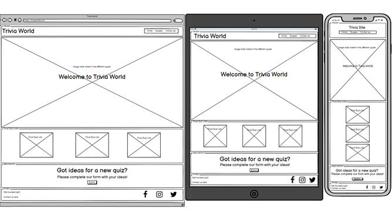
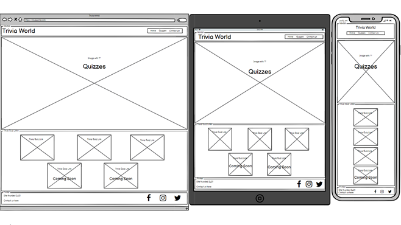
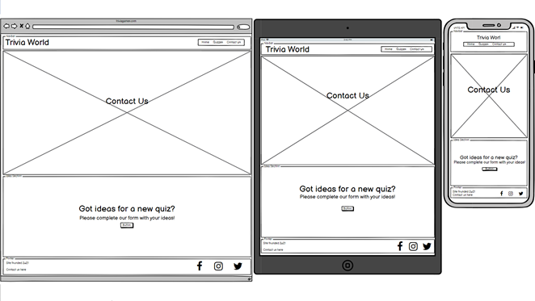

# Trivia World Website

## Interactive Front-End Development

---

(Add screenshot of responsive design when site is complete)

This site has been created and designed for the user to test their knowledge on different subjects, relax and have a little fun. The aim is to provide the user with a visually pleasing and fluid design throughout with responsive elements to aid the users experience.

---
---

## Table of contents

---

- [UX](#ux)
    - [Project Goals](#project-goals)
    - [User Goals](#user-goals)
    - [User Stories](#user-stories)
    - [Wireframes](#wireframes)
    - [Surface](#surface)
- [Features](#features)
    - [Navigation Bar](#navigation-bar)
    - [Home Page](#home-page)
    - [Quizzes Page](#quizzes-page)
    - [Contact Us Page](#contact-us-page)
    - [Footer](#footer)
- [Technologies Used](#technologies-used)
- [Testing](#testing)
    - [Functionality Testing](#functionality-testing)
    - [Compatibility Testing](#compatibility-testing)
    - [User Story Testing](#user-story-testing)
    - [Issues and Bugs](#issues-and-bugs)
    - [Performance Testing](#performance-testing)
    - [Code Validation](#code-validation)
- [Deployment](#deployment)
- [Credits](#credits)
    - [Learning resources and styling ideas](#learning-resources-and-styling-ideas)
    - [Code](#code)
    - [Images Used](#images-used)
- [Other Information](#other-information)
- [Project Screenshots](#project-screenshots)

---
---

## UX

---

### Project Goals

The primary goal of the Trivia World website is to provide a site where users can visit to test their knowledge on subjects to relax and have fun. The website will therefore have a welcoming, consistant and soft feel to it for the design choices and colours picked.

### User Goals

#### User goals:

* User can easily navigate to quizzes.
* User finds the site relax with a soft feel.
* User has the option to submit ideas for new quizzes.

### User Stories

#### As the site owner I would like:

* To provide a relaxing and easy to use website which allows the user to test their knowledge on subjects.
* Be contacted about new quiz ideas.

#### As a new user to the site:

* I would like to test my knowledge on different subjects.
* Relax and unwind whilst having fun.
* Contact the owner about new ideas for quizzes.

### Wireframes

I used [balsamiq.com](https://balsamiq.com/) to create the wireframes.

Home Page

Quizzes Page

Contact Us Page

### Surface

#### Colours

The colours used in this project are as follows:

* #120078 - This colorr is primarily used as the navbar and footer background colour.
* #FD3A69 - This is the secondary colour and is used both for font and as a background colour.
* #FECD1A - This colour is the tertiary colour and is used as a background colour. 

#### Fonts

* Primary font - 'Nunito' was chosen as the charecters apear soft in the way the round at every end.
* Secondary font - 'Lato' was chosen as this is a clear font and will be used for questions and answers so the users will not struggle to read it.
* Back-up font - 'sans-serif' chosen as a back-up font as it's a standard universal font.

#### Images

Back to [Table of Contents](#table-of-contents)

## Features

---

### Navigation Bar
### Home Page
### Quizzes Page
### Contact Us Page
### Footer
## Technologies used

---

#### HTML5

* Used as a structural language.

#### CSS

* Used as a style language.

#### Bootstrap

* [Boostrap](https://getbootstrap.com/) Version 4.3.1 used as a CSS framework to aid responsive design. A mobile first approach was taken.

#### Font Awesome

* [Font Awesome](https://fontawesome.com/) was used for social links, skiing and snowboarding headings and for table headings.

#### Google Fonts

* [Google Fonts](https://fonts.google.com/) used as a font resource.

#### GitHub

* [GitHub](https://github.com/) was used as the site's repository.

#### Gitpod

* [Gitpod](https://gitpod.io/workspaces/) was used as a development hosting platform.

#### Wireframes

* [Balsamiq.com](https://balsamiq.com/) was used as a wireframe tool to sketch the structure of the site.

Back to [Table of Contents](#table-of-contents)

## Testing
### Functionality Testing
### Compatibility Testing
### User Story Testing
### Issues and Bugs
### Performance Testing
### Code Validation
## Deployment
## Credits

---

Upon creating this project within GitHub I used the Code Institute student template: [gitpod full template](https://github.com/Code-Institute-Org/gitpod-full-template)

### Learning resources and styling ideas

* [Code Institute](https://learn.codeinstitute.net/login?next=/dashboard)
    * Throughout this project I have referred back to lots of different modules to refresh myself on good practices.
* [W3Schools](https://www.w3schools.com/)
    * I have used this site throughout the course when looking for ideas or potential stylings to code.
* [CSS-Tricks](https://css-tricks.com/)
    * I have occasional visited this site for ideas and potential fixes throughout the course.
* [Bootstrap](https://getbootstrap.com/)
    * Throughout this project I have visited this site many times to create the pages structure and give ideas and coding examples.
    * I have also read up on ever class I have used to understand exactly what it will do to the site when used.
* [Stack Overflow](https://stackoverflow.com/)
    * I have visited this site a few times throughout the course however I have avoided it whilst building this site as I wanted to work out how to do most of the code myself and not just see fixes.
* [Code Academy](https://www.codecademy.com/)
    * I have not visited this site recently however this is where I first started learning to code.
* [Color Hunt](https://colorhunt.co/palettes/popular)
    * I used Color Hunt to find a contrasting palette of four colours to use throughout the site.

### Code
### Images Used

[Unsplash Images](https://unsplash.com/) 

* hero_img.jpg - [qimono](https://pixabay.com/illustrations/question-mark-pile-questions-symbol-2492009/)

* quiz_img1.jpg - [Cara Fuller](https://unsplash.com/photos/QF38t6obcnk)

* quiz_img2.jpg - [redcharlie](https://unsplash.com/photos/jNtv6K1RFek)

* quiz_img3.jpg - [Sid Balachandran](https://unsplash.com/photos/_9a-3NO5KJE)

## Other Information
## Project Screenshots